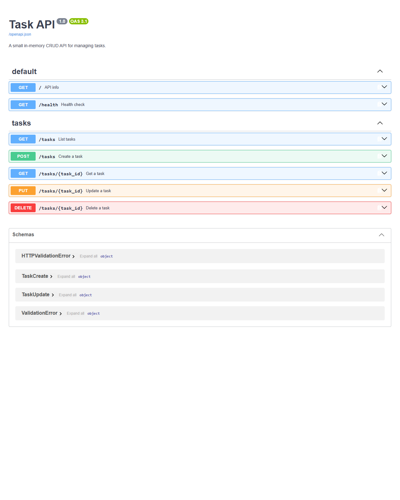
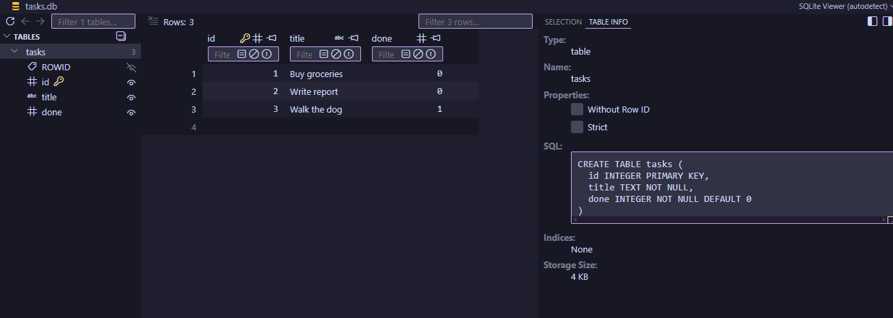

# Task API

A small CRUD API for managing a to-do list, built with FastAPI and backed by SQLite.

## Install & run

```
pip install -r requirements.txt
uvicorn main:app --reload --port 8000
```

Server runs at http://localhost:8000. Interactive docs at http://localhost:8000/docs.

The database file and its table are created automatically on first run, no setup steps needed.

## Endpoints

| Method | Path         | Description                          |
|--------|--------------|---------------------------------------|
| GET    | /            | API info                              |
| GET    | /health      | Health check                          |
| GET    | /tasks       | List all tasks                        |
| GET    | /tasks/{id}  | Get a single task                     |
| POST   | /tasks       | Create a task                         |
| PUT    | /tasks/{id}  | Update a task's title and/or done     |
| DELETE | /tasks/{id}  | Delete a task                         |

## Example

```
$ curl -i -X PUT http://localhost:8000/tasks/4 -H "Content-Type: application/json" -d '{"done":true}'
HTTP/1.1 200 OK
content-type: application/json

{"id":4,"title":"Buy milk","done":true}
```

## Swagger UI



## Database

Tasks are stored in SQLite. SQLite was chosen because it needs no server or installation — the whole database is one file, which is ideal for a small project like this and for learning SQL directly.

The database file lives at `tasks.db` in the project root. It is created automatically the first time the app runs, along with the `tasks` table, and it is ignored by git so a fresh clone always starts from the same seed data. On an empty table, three example tasks are inserted; after that, tasks created, updated, or deleted through the API persist across restarts.

## Database viewer



Example query run against `tasks.db`:

```
sqlite> SELECT * FROM tasks WHERE done = 1;
3|Walk the dog|1
```

More queries used to explore the database are in [docs/queries.sql](docs/queries.sql).
